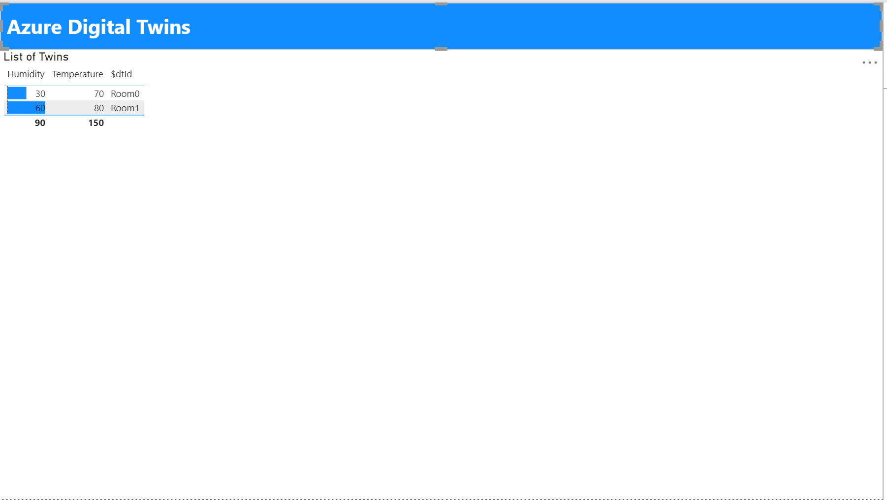

# powerbi-adt
   

## Overview
An example showing how to query [Azure Digital Twins](https://docs.microsoft.com/en-us/azure/digital-twins/how-to-manage-twin#create-a-digital-twin) from within PowerBI. You could use this to query the current state of your IoT devices, for example, to use the [Anomaly Detector](https://docs.microsoft.com/en-gb/azure/cognitive-services/anomaly-detector/) cognitive service to check the state of outliers.

powerbi-adt is available under the [MIT Licence](./LICENCE).

## Setting up
1. Create an Azure Digital Twin
2. Give yourself access to the data plane - add some example data - the [Azure Digital Twins explorer](https://github.com/Azure-Samples/digital-twins-explorer/) example data is a good start.
3. Create a virtual environment for your Python setup, e.g. `python3 -m venv .venv`
4. Install the requirements `pip install -r requirements-dev.txt`
5. Copy the path to your venv
6. [Enable python scripting](https://docs.microsoft.com/en-us/power-bi/connect-data/desktop-python-scripts#enable-python-scripting) in PowerBI
7. Log in to Azure on the CLI with `az login`
8. Import the **powerbi-query.py** as a [PowerBI datasource](https://docs.microsoft.com/en-us/power-bi/connect-data/desktop-python-scripts#run-your-python-script-and-import-data)

### Example
You should see something like this...

## Contact
Feel free to contact me [on Twitter](https://twitter.com/sealjay_clj). For bugs, please [raise an issue on GitHub](https://github.com/Sealjay-clj/powerbi-adt/issues).

## Contributing
Contributions are more than welcome! This repository uses the [GitHub flow](https://guides.github.com/introduction/flow/) - and you can choose to use [Commitizen](https://github.com/commitizen/cz-cli#making-your-repo-commitizen-friendly) to support the use of [semantic commits](https://nitayneeman.com/posts/understanding-semantic-commit-messages-using-git-and-angular/#common-types). (`npm install -g commitizen cz-customizable`and then `git cz`- easy!)